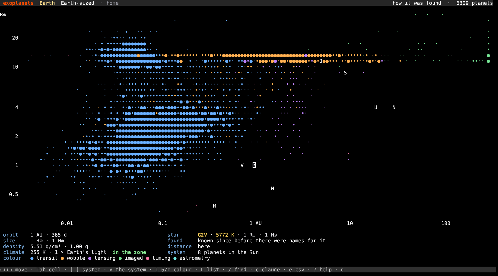
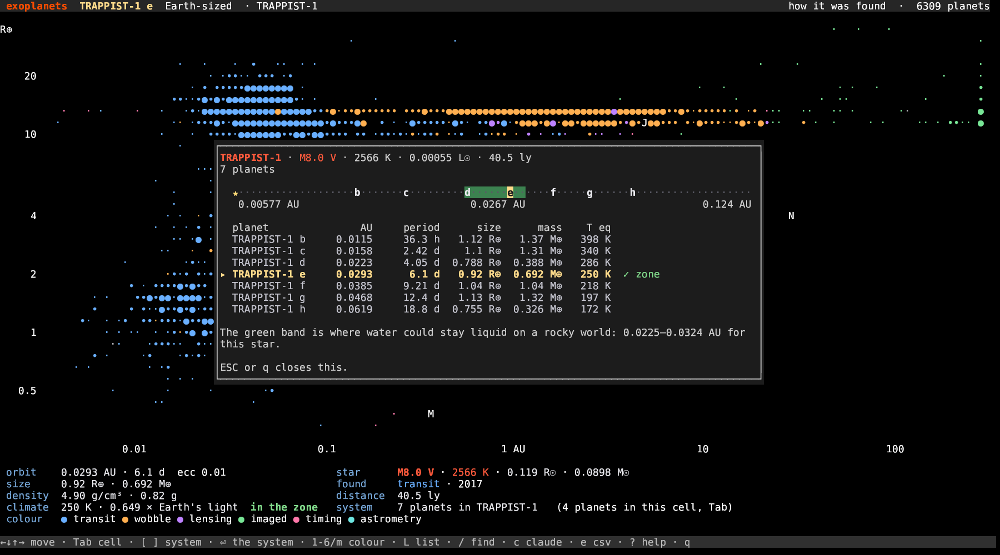

# exoplanets



**Every known world outside the solar system, on one diagram. Written in Rust.**

     [](https://github.com/isene/fe2o3)

How far out a planet orbits runs across, how big it is runs up, 6,309 of
them, and our own eight in white for scale. The hot Jupiter pileup, the
gap where the Kepler field ran out of time, the valley at 1.8 Earth radii
that planets avoid: none of it is drawn in, it all falls out of the data.

Press Enter and the system unfolds, with the band where water could stay
liquid painted behind it.



## Features

- **6,309 planets** from the NASA Exoplanet Archive: orbit, period, size,
  mass, eccentricity, equilibrium temperature, host star and distance
- **Walk it** with the arrow keys, cell by cell. `Tab` cycles through the
  planets sharing a cell, `[` and `]` move in and out through one system
- **The whole system** (`Enter`): every planet of that star on a log
  scale, with the habitable zone as a green band and a row of numbers per
  planet
- **Six colour modes** (1-6, or `m`): how it was found, equilibrium
  temperature, year found, distance, host star temperature, and bulk
  density
- **Derived where it helps**: density and surface gravity from mass and
  radius, the star's luminosity from its size and temperature, the
  habitable zone from that, and sunlight relative to Earth's
- **Find one** (`/`) by planet or by star: `TRAPPIST-1 e`, `51peg`,
  `kepler-452b`
- **Ask Claude** (`c`) about the planet you are looking at, with its
  numbers and its system as context
- **Export** (`e`) the catalogue to `~/exoplanets.csv`, ordered by the
  current colour mode, with every derived column
- **Offline and idle-free**: the table ships inside the binary, and the
  app blocks on a keypress like the rest of the suite



## Install

```bash
curl -L "https://github.com/isene/exoplanets/releases/latest/download/exoplanets-linux-x86_64" \
  -o ~/bin/exoplanets && chmod +x ~/bin/exoplanets
```

Or build it: `cargo build --release`. It needs
[crust](https://github.com/isene/crust) checked out beside it.

## Key bindings

| Key | Action |
|-----|--------|
| ← →, h l | Nearer / further out |
| ↑ ↓, k j | Smaller / bigger |
| Tab, Shift+Tab | Through the planets sharing one cell |
| [ ] | In and out through one system |
| Enter | The whole system, with its habitable zone |
| 1-6, m | Colour by: how it was found, temperature, year, distance, host star, density |
| L | List what is in this cell, and pick from it |
| / | Find a planet or a star |
| c | Ask Claude about this planet |
| Ctrl-A | A full Claude session about what is on screen, as in every Fe₂O₃ app |
| e | Write the catalogue to `~/exoplanets.csv` |
| r | Redraw from scratch |
| ? | Help |
| q | Quit |

## CLI

```bash
exoplanets                 # opens on Earth
exoplanets "TRAPPIST-1 e"  # or 51peg, kepler-452b, proxima
exoplanets --help
```

## Where the numbers come from

The [NASA Exoplanet Archive](https://exoplanetarchive.ipac.caltech.edu/)
composite table (`pscomppars`), which carries one agreed value per
parameter per planet, fetched once and compiled in.

Some things worth knowing about what you are looking at:

- **Every planet has a semi-major axis**, because that is the x-axis. For
  the 750 or so that were published with only one of the two, the other
  comes from Kepler's third law and the star's mass; the readout marks
  those with a `*`.
- **A few dozen planets have a mass but no measured radius.** They are
  drawn at the size that mass implies, by the broken power law Chen and
  Kipping fitted in 2017, and the readout says so.
- **The habitable zone and the sunlight figure are derived** from the
  star's radius and temperature, so they are only as good as those two.
  Being in the zone says where water could stay liquid on a rocky world.
  It does not say the planet is rocky, or that anything lives there.
- **Beyond 316 AU the diagram stops**, and the few directly imaged
  companions further out sit against the right edge.
- Seven planets in the archive have neither a size nor a mass. They have
  nowhere to sit, so they are left out.

## Part of the Rust Terminal Suite (Fe₂O₃)

See the [Fe₂O₃ suite overview](https://github.com/isene/fe2o3) and the
[landing page](https://isene.org/fe2o3/). It sits next to
[stars](https://github.com/isene/stars) (the HR diagram),
[astro](https://github.com/isene/astro) (the sky tonight),
[elements](https://github.com/isene/elements) (the periodic table) and
[isotopes](https://github.com/isene/isotopes) (the chart of the nuclides).

## License

Public domain (Unlicense). Take it, fork it, or ignore it.

— [Geir Isene](https://isene.com)
